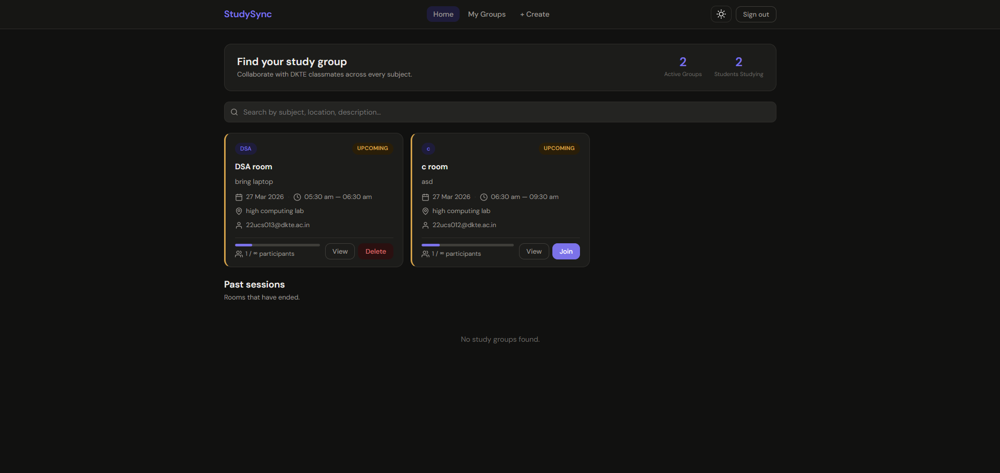
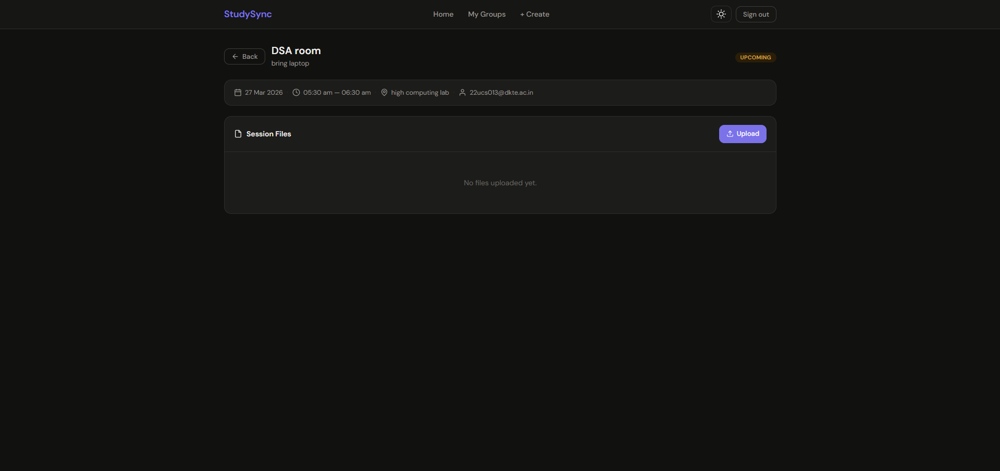
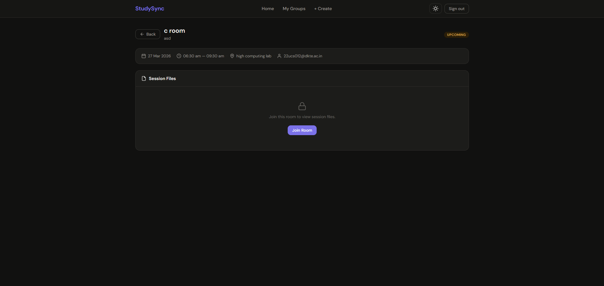
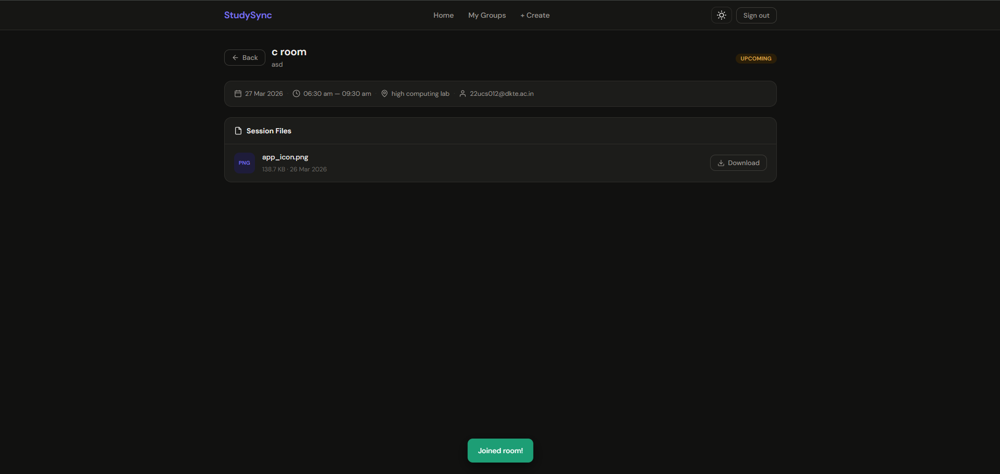

# StudySync — DKTE College

A real-time study group coordination app for DKTE College students. Find, create, and join study rooms with classmates across every subject.

🔗 **Live:** [studysync-dkte.netlify.app](https://studysync-dkte.netlify.app)

---

## Screenshots









## Features

- **Auth** — Sign up / sign in restricted to `@dkte.ac.in` email addresses
- **Study Rooms** — Create rooms with subject, location, date, start & end time
- **Join / Leave** — Join open rooms, leave anytime; host can delete their room
- **Capacity Limits** — Optional max participant cap with a live progress bar
- **Session Files** — Members can view and download files; host can upload and delete
- **Room Status** — Rooms are automatically marked Upcoming, Ongoing, or Completed
- **Conflict Detection** — Prevents duplicate subject or location bookings in the same time slot
- **Dark Mode** — Persisted theme preference
- **Live Stats** — Active groups and total students studying shown on the home page

## Tech Stack

| Layer    | Technology                          |
|----------|-------------------------------------|
| Frontend | Vanilla HTML, CSS, JavaScript (ESM) |
| Backend  | Supabase (Postgres + Auth + Storage)|
| Hosting  | Netlify                             |

## Getting Started

No build step required — it's plain HTML/CSS/JS.

1. Clone the repo
   ```bash
   git clone https://github.com/anonSoham/StudySync.git
   cd StudySync
   ```
2. Serve locally with any static server, e.g.:
   ```bash
   npx serve .
   ```
3. Open `http://localhost:3000` in your browser.

> The app uses a hosted Supabase project — no local database setup needed.

---
